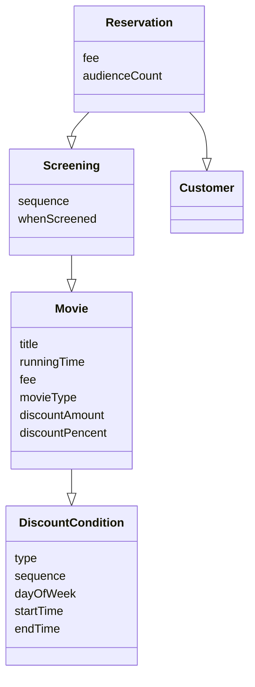

> 객체지향 설계란 올바른 객체에게 올바른 **책임**을 할당하면서 **낮은 결합도와 높은 응집도**를 가진 구조를 창조하는 활동이다.
>

- 객체의 상태(구현)가 아닌 객체의 행동(인터페이스)에 초점을 맞추는 것이다.
    - 행동이 상태를 결정한다.
    - 결합도와 응집도를 합리적인 수준으로 유지할 수 있는 방법
- 객체의 책임에 초점을 맞춰 설계해야 한다.

데이터 중신의 영화 예매 시스템

- 시스템을 객체로 분할할 수 있는 방법
    - 상태(= 데이터)를 분할의 중심축으로 삼는다.
    - 책임을 분할의 중심축으로 삼는다.

| 데이터 | 책임 |  |
| --- | --- | --- |
| 상태 | 행동 | 초점 |
| 독립된 데이터 덩어리 | 협력하는 공동체의 일원 | 객체는 |
| 객체는 자신이 포함하고 있는 데이터를 조작하는 데 필요한 오퍼레이션을 정의한다. | 다른 객체가 요청할 수 있는 오퍼레이션을 위해 필요한 상태를 보관한다. | 객체는 |

**⇒ 책임을 분할의 중심축으로 삼아야 한다.**

상태를 객체 분할의 중심축으로 삼으면 구현의 변화 = 상태 변경에 따라 인터페이스 변화도 발생 ⇒ 이는 인터페이스에 의존하는 모든 객체에게 변경의 영향을 줄 수 있다.

---

---

<aside>

> 가끔씩은 좋은 설계보다는 나쁜 설계를 살펴보는 과정에서 통찰을 얻기도 한다.
>
</aside>

(영화 예매 시스템을 예시로 설계 시작)

### 데이터 중심 설계

```java
public class Movie {
    private String title;
    private Duration ruggningTime;
    private Money fee;
    private List<DiscountCondition> discountConditions;
    
    private MovieType movieType; // 영화에 사용된 할인 정책의 종류를 알 수 있는 방법..
    private Money discountAmount;
    private double discountPercent;
}

public enum MovieType {
    AMOUNT_DICOUNT, // 금액 할인 정책
    PERCENT_DISCOUNT, // 비율 할인 정책
    NONE_DISCOUNT // 미적용
}
```

⇒ 이런 형태의 설계를 많이 했었고 하기 싫어서 고민하다 나온게 책임 중심의 설계..

- 객체가 포함해야 하는 데이터에 집중한다.
    - movieType 으로 어떤 할인 금액이 사용되었는지 판단한다.



- `ReservationAgency`
    - 할인 요금을 계산하기 위해서 할인 정책의 타입에 따라 할인 요금을 계산하는 로직을 분기해야 한다.

    ```java
    public Reservation reserve(Screening screening, Customer customer, int audienceCount) {
            Movie movie = screening.getMovie();
    
            boolean discountable = false;
            for (DiscountCondition condition : movie.getDiscountConditions()) {
                if (condition.getType() == DiscountConditionType.PERIOD) {
                    discountable = screening.getWhenScreened().getDayOfWeek().equals(condition.getDayOfWeek()) &&
                            !condition.getStartTime().isAfter(screening.getWhenScreened().toLocalTime()) &&
                            !condition.getEndTime().isBefore(screening.getWhenScreened().toLocalTime());
                } else {
                    discountable = condition.getSequence() == screening.getSequence();
                }
    
                if (discountable) {
                    break;
                }
            }
    
            Money fee;
            if (discountable) { // 할인 여부
                Money discountAmount = switch (movie.getMovieType()) {
                    case AMOUNT_DISCOUNT -> movie.getDiscountAmount();
                    case PERCENT_DISCOUNT -> movie.getFee().times(movie.getDiscountPercent());
                    case NONE_DISCOUNT -> Money.ZERO;
                };
    
                fee = movie.getFee().minus(discountAmount).times(audienceCount);
            } else {
                fee = movie.getFee();
            }
    
            return new Reservation(customer, screening, fee, audienceCount);
        }
    ```


---

### [ 품질 척도 ]

- 캡슐화 : 변경 가능성이 높은 부분(구현)을 객체 내부로 숨기는 추상화 기법
    - 구현 :  변경 될 가능성이 높은 부분
    - 인터페이스 : 상대적으로 안정적인 부분
- 응집도 : 모듈의 포함된 내부 요소들이 연관되어 있는 정도
    - 높은 응집도 : 하나의 요구사항 변경을 반영 하기 위해 오직 하나의 모델만 수정하면 된다
- 결합도 : 의존성 정도를 나타내며 다른 모듈에 대해 얼마나 많은 지식을 갖고 있는지를 나타내는 척도
    - 낮은 결합도 :
        - 모듈 A를 변경했을때 오직 하나의 모듈만 영향을 받는다.
        - 퍼블릭 인터페이스를 수정했을때만 다른 모듈에 영향을 미친다. (좀 헷갈리는데잉)
        - 결합도가 높아도 상관없는 경우? 변경 확률이 매우 적은 안정적인 모듈

---

- 캡슐화
    - (과도한 접근자와 수정자) getFee, setFee 메서드가 fee의 존재를 알린다..

```java
    
public class Movie {
    private Money fee;
    
    public Money getFee() {
	    return fee;
    }
    
    public void setFee(Money fee) {
	    this.fee = fee;
    }
}
```

- 높은 결합도
    - fee type 변경 시 ReservationAgency 코드도 바꿔줘야 함
    - 너무 많은 대상에 의존하기 때문에 변경에 취약한 ReservationAgency

```java
public Reservation reserve(Screening screening, Customer customer, int audienceCount) {
        ...

        Money fee;
        if (discountable) { // 할인 여부
            ...
            fee = movie.getFee().minus(discountAmount).times(audienceCount);
        } else {
            fee = movie.getFee();
        }

        ...
    }
```

- 낮은 응집도
    - 할인 정책을 선택하는 코드 and 할인 조건을 판단하는 코드
    - movieType 추가 시 MovieType, Movie, ReservationAgency 수정해야함!
    - 단일 책임 원칙

---

> 💬 공감되는 부분이 많았음. 좋은 설계에 대한 고민이 많이 많이 생겼음. 요즘에 개발할때 객체지향적인 좋은 설계를 위해 고민이 됨.. 얼른 책을 다 읽고 싶음!
>

---

### Rectangle

```java
public class RectangleManageBadClass {
    void enlarge(Rectangle rectangle, int multiple) {
        rectangle.setRight(rectangle.getRight() * multiple);
        rectangle.setBottom(rectangle.getBottom() * multiple);
    }
}
```

- 코드 중복
- 변경에 취약

```java
class Rectangle {
    public void enlarge(int multiple) {
        this.right *= multiple;
        this.bottom *= multiple;
    }
}
```

- 객체가 자기 스스로를 책임진다.

---

- 이 객체가 어떤 데이터를 포함해야 하는가?
- 이 객체가 데이터에 대해 수행해야 하는 오퍼레이션은 무엇인가?

DiscountCondition.isDiscountable()

Movie.calculateXXDiscountFee()

Movie.isDiscountable()

```java
    public Reservation reserve(Screening screening, Customer customer, int audienceCount) {
        Money fee = screening.calculateFee(audienceCount);
        return new Reservation(customer, screening, fee, audienceCount);
    }
```

- 좀 더 면밀해진 캡슐화로 의존성이 줄어듬

**하지만,, 여전히,, 캡슐화는 완벽하지 않고 낮은 응집도를 가진다.**

```java
public boolean isDiscountable(DayOfWeek dayOfWeek, LocalTime time);
public boolean isDiscountable(int sequence);

public Money calculateAmountDiscountFee();
public Money calculatePercentDiscountFee();
public Money calculateNoneDiscountFee();
```

⇒ 캡슐화는 단순히 객체 내부의 데이터를 외부로부터 감추는 것 이상이상이다. 변하는 어떤 것이든 감추는 것!

> 💬 완벽한 캡슐화, 완벽한 높은 응집도와 낮은 결합도는 어려운 것 같다.
>

---

### 데이터 중심 설계의 문제점

- 너무 이른 시기에 데이터에 관해 결정하도록 강요시킨다.
- 협력이라는 문잭을 고려하지 않고 객체를 고립시킨 채 오퍼레이션을 결정한다.

⇒ 데이터 중심 설계 방식에 익숙한 개발자들은 일반적으로 데이터와 기능을 분리하는 절차적 프로그래밍 방식을 따른다. (뜨끔❗️)

⇒ 올바른 객체지향 설계의 무게의 중심은 항상 객체의 내부가 아닌 외부에 맞춰져 있어야 한다.