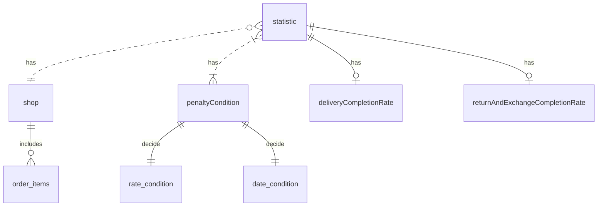

<aside>
💡 GRASP(General Responsibility Assignment Software Patterns) 패턴

</aside>

---

## 책임 중심 설계

- 데이터보다 행동을 먼저 결정하라
- 협력이라는 문맥 안에서 책임을 결정하라

### 데이터보다 행동을 먼저 결정하라

데이터 < 외부에 제공하는 행동 (객체의 책임)

- 객체가 수행해야 하는 책임은 무엇인가
- 이 책임을 수행하는 데 필요한 데이터는 무엇인가

💬 어,, 나 책임 중심 설계 했었나보다..?

적절한 객체에서 적절한 책임을 할당해야하는데 그 방법은?

### 협력이라는 문맥 안에서 책임을 결정하라

- 적합한 책임 : 메세지 수신자가 아니라 메시지 전송자(클라이언트 관점)에게 적합한 책임 (?)
- 객체가 메시지를 선택하는 것이 아니라 메시지가 객체를 선택하게 해야한다.

### 책임 주도 설계

- 시스템이 사용자에게 제공해야 하는 기능인 시스템 책임을 파악한다.
- 시스템 책임을 더 작은 책임으로 분할한다.
- 분할된 책임을 수행할 수 있는 적절한 객체 또는 역할을 찾아 책임을 할당한다.
- 객체가 책임을 수행하는 도중 다른 객체의 도움이 필요한 경우 이를 책임질 적절한 객체 또는 역할을 찾는다.
- 해당 객체 또는 역할에게 책임을 할당함으로써 두 객체가 협력하게 된다.

---

## 책임 할당을 위한 GRASP 패턴

> 일반적인 책임 할당을 위한 소프트웨어 패턴
>

도메인 개념에서 출발하기

정보 전문가에게 책임을 할당하라

- 정보 전문가 패턴 (다시 언급)

높은 응집도와 낮은 결합도

DiscountCondition이 Movie와 협력할지 Screening과 협력할지 결정해야 한다.

- Low coupling(낮은 결합도) 패턴
- High cohesion(높은 응집도) 패턴

창조자에게 객체 생성 책임을 할당하라

- Creator (창조자) 패턴
    - 어떤 방식으로든 생성되는 객체와 연결되거나 관련될 필요가 있는 객체에 해당 객체를 생성할 책임을 맡기는 것이다.
    - 이미 존재하는 객체 사이의 관계를 이용하기 때문에 낮은 결합도를 유지할 수 있다.

---

## 구현을 통한 검증

💬 메세지 기반으로 클래스 작성.. 을 해보니 여태 해왔던 방식이었던 것 같다. 데이터 설계를 먼저하고 spring에 따라 단계 구성하는게 습관화 되었을 뿐..

---

따라 구현하면서 이게 맞나..? 싶은 부분이 좀 있었음

- (응집도가 낮다) DiscountCondition.isSatisfiedBy ⇒ 새로운 할인 조건이 추가되거나 순번/기간 조건을 판단하는 로직이 변경되는 경우  DiscountCondition에 메소드를 수정해야할 뿐만 아니라 속성을 추가해줘야 한다.

---

**‼ [ 코드를 통해 변경의 이유를 파악할 수 있는 방법 ] ‼**

- 인스턴스 변수가 초기화되는 시점을 살펴본다.
    - 응집도 낮은 클래스는 객체의 속성 중 일부만 초기화하고 일부는 초기화되지 않은 상태로 남겨진다. (이런거 꽤 있는거 같은디)
    - **함께 초기화되는 속성을 기준으로 코드를 분리해야 한다.**
- 메서드들이 인스턴스 변수를 사용하는 방식을 살펴본다.
    - 모든 메서드가 객체의 모든 속성을 사용한다면 클래스의 응집도는 높다고 볼 수 있다. (⇒ Entity와 Domain class가 똑같을 순 없는 이유)
    - 속성 그룹과 해당 그룹에 접근하는 메서드 그룹을 기준으로 코드를 분리해야 한다.

[ 타입 분리하기 ]

- DiscountCondition 분리 ⇒ Movie가 두 클래스와 결합됨..
    - PeriodDisoucntCondition
    - SequenceDiscountCondition
- 다형성을 통해 분리 `역할`
    - POLYMORPHISM (다형성) 패턴
        - 객체의 타입에 따라 변하는 행동이 있다면 타입을 분리하고 변화하는 행동을 각 타입의 책임으로 할당한다.

[ 변경으로부터 보호하기 ]

- PROTECTED VARIATIONS (변경 보호) 패턴
    - 설계에서 변하는 것이 무엇인지 고려하고 변하는 개념을 캡슐화하라
- Movie도 MovieType이 아닌 abstract Movie 와 AmountDicountMovie, PercentDiscountMovie로 분리 ⇒ PenaltyLevel enum 또한 이렇게 분리가 가능할 수 있을까?

[ 변경과 유연성]

- 변경에 대비하는 법
    - 최대한 단순하게 설계한다.
    - 코드를 수정하지 않고도 변경을 수용할 수 있는 코드를 만든다.
- 절차형 코드로 실행되는 프로그램을 빠르게 작성 → 완성된 코드를 객체지향적인 코드로 변경한다.

---

## 책임 주도 설계의 대안

- 리팩토링

메서드 응집도

- 몬스터 메서드(monster method)

객체를 자율적으로 만들자